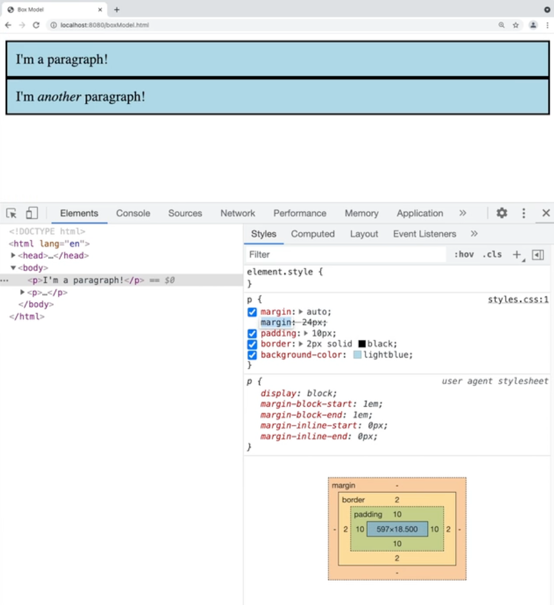

## Specificity

##### It is roughly calculated by counting the number of each selector type involved in a selector and multiplying by a weight. These weights are as follow:  

<br/>

* ##### **Inline Styles** - 1000
* ##### **IDs** - 100
* ##### **Classes** - 10
* ##### **Pseudo-Classes** - 10
* ##### **Attributes** - 10
* ##### **Elements** - 1
* ##### **Pseudo-Elements** - 1

<br/>

For example:
```css
a[href="https://algoexpert.io"] { 
	color: green;
}
```
> has a weight of 11 (1 + 10), whereas the following has 12 (1 + 10 + 1):
```css
section.links a {
	color: red;
}
```

---

## Block Element

##### It has a key properties:  
##### An element with its `display` property set to `block`.
* ##### They start on new lines
* ##### By default they span the entire width of their parent

## Inline Element
##### An element with its `display` property set to `inline`.
* ##### They start immediately after the content before them, without a new line
* ##### They span the width of their content
* ##### `width` and `height` properties have no effect on them

## Inline-Block Element
##### An element with its `display` property set to `inline-block`.
* ##### They start immediately after the content before them, without a new line
* ##### They span the width of their content by default, but this can be changed

<hr>
</br>

## Use of developer tools from Chrome

##### Pay attention to the elements such as padding, border, and margin.



<hr>

##### **NOTE: Remember that STACKING CONTESTS with the z-index do take into account their parents in HTML. Plus, that it can be assigned a negative value.**

<hr>

## Flexbox

##### Used to build responsive designs with row or column layours. An element can be made a **flex container** with `display: flex`, and all of its direct children will automatically be laid out as **flex items**.

##### These are some of the most common properties used to layout their flex items:

</br>

### For Flex Containers:

* ##### **flex-direction**: Determines the direction of the main-axis.
* ##### **justify-content**: Determines how elements are positioned along the **main-axis**.
* ##### **align-items**: Determines how elements are positioned along with the **cross-axis**.
* ##### **flex-wrap**: Determines if flex items can wrap to new lines.
* ##### **align-content**: Determines how lines are positioned along the **cross-axis** when flex items are wrapping on multiple lines.
* ##### **flex-flow**: A shorthand for `flex-direction` and `flex-wrap`.
* ##### **gap**: Determines the amount of space between flex items. This can take one or two length values. If two are given they will be treated as a row gap and a column gap respectively.

</br>

### For Flex Items:

* ##### **align-self**: Overrides the `align-items` value used for the flex container.
* ##### **flex-basis**: Sets the initial size of the flex item along the **main-axis** (essentially this will act as width for the row axis and height for the column axis).
* ##### **flex-grow**: Determines if the flex item is able to grow into extra space. If the value is 0, the flex item will not grow. Otherwise, it will take up as much extra space as possible, with larger grow values taking more space proportionally. For example, if item A has a value of 1 and item B has a value of 2, then item B will take up twice as much extra space as item A (Note this does not mean it will be twice as large, only that it will take twice as much of the extra space)
* ##### **flex-shrink**: Determines if a flex item is able to shrink in the case that the flex items are too large for the container. Flex items with a value of 0 will not shrink. Otherwise they will all shrink proportionally based on their values, similar to flex grow. The higher the value, the more the flex item will potentially shrink.
* ##### **flex**: A shorthand property for `flex-grow`, `flwx-shrink`, and `flex-basis` in that order.
* ##### **order**: Moves the flex-item to a different location amongst the other flex items rather than using the order defined in the DOM. All flex items default to having a value of 0. This means a value of -1 would move an item before all other items that have not changed their order. Likewise, a value of 1 would place the item at the end.

<hr>

## CSS Grid

##### Used to create responsive layouts of multiple rows and columns. An element can be made a grid **container** with `display: grid`, and all of its direct children will automatically be laid out as **grid items** in a single cell.

##### A rectangular subsection of a grid is known as a **grid area**. The dividers between each row and column are known as **grid lines**, and the rows and columns they create are called **tracks**.

</br>

### For Grid Containers:
* ##### **grid-template-columns**: Determines the number of columns and their sizes.
* ##### **grid-template-rows**: Determines the number of rows and their sizes.
* ##### **grid-template-areas**: Creates names for grid areas that grid items can place themselves in.
* ##### **align-items**: Determines how grid items are aligned in columns (called the block-axis).
* ##### **justify-items**: Determines how grid items are aligned in rows (called the inline-axis).
* ##### **place-items**: A shorthand for both `align-items` and `justify-items`. If one value is given, it will apply to both. If two values are given, they will apply to `align-items` and `justify-items` respectively.
* ##### **gap**: Determines the amount of space between grid items. This can take one or two length values. If it is given two, they will be treated as a row gap and a column gap respectively.

</br>

### For Grid Items:

* ##### **grid-column-start**: Determines what column this item starts on, based on a line number.
* ##### **grid-column-end**: Determines what column this item ends on, based on a line number.
* ##### **grid-column**: A shorthand for both `grid-column-start` and `grid-column-end`.
* ##### **grid-row-start**: Determines what row this item starts on.
* ##### **grid-row-end**: Determines what row this item ends on.
* ##### **grid-row**: A shorthand for both `grid-row-start` and `grid-row-end`.
* ##### **grid-area**: Places the item in a grid-area based on a name created in `grid-template-areas`.
* ##### **align-self**: Overrides the `align-items` value used for the grid container.
* ##### **justify-self**: Overrides the `justify-items` value used for the grid container.
* ##### **place-self**: A shorthand for both `align-self` and `justify-self` in the same format as `place-items`.

<hr>

## CSS Inheritance

</br>

##### All properties are either **inherited properties** or **non-inherited properties**. Inherited will take their parent's value in the case no value has been set for the property. Non-inherited properties will be set to `initial` in this case.

</br>

* ##### **inherit**: The value should inherit from its parent, regardless if it is normally an inherited property.
* ##### **initial**: The value should be set to the value defined in the CSS specification. Note that this is oftentimes different from browser defaults.
* ##### **unset**: The value should be set to `inherit` if it is normally an inherited property, otherwise `initial`. This can be useful for "resetting" browser defaults from the user agent stylesheet.
* ##### **revert**: The value should revert back to the next stylesheet in the cascade. For author stylesheets, this would act as if the author did not write any declaration for the property, but it would still honor the user agent and user stylesheets as normal.

<hr>

## Animations

</br>

### Transitions

* ##### **transition-property**: The name of the CSS property to transition.
* ##### **transition-duration**: How long the transition will take.
* ##### **transition-timing-function**: How the transition should progress. This can take a variety of keyword values, such as `linear` and `ease-in`, or custom values using the `cubic-bezier()` or `steps()` functions.
* ##### **transition-delay**: How long to wait before starting the transition.

##### Alternatively, the `transition` property can be used as a shorthand for all of these values.

</br>

### Animations
* ##### **animation-name**: The name of the `keyframes` animation.
* ##### **animation-duration**: How long the animation should take.
* ##### **animation-fill-mode**: If the element should stay in its animated position after the animation completes or if it should move to the starting position of the animation before it begins, specified with the `backwards` and `forwards` values respectively or `both` to follow the rules of both values.
* ##### **animation-direction**: If the animation should play in `normal` or `reverse` order. A value of `alternate` can also be used to switch between normal and reverse, or `alternate-reverse` can be used to do the same, but starting with the reverse direction.
* ##### **animation-iteration-count**: How many times to run the animation, or `infinite` to run the animation indefinitely.
* ##### **animation-play-state**: If the animation is currently `running` or `paused`. This is particularly useful for pausing an animation using JavaScript.
* ##### **animation-timing-function**: How the animation should progress through the keyframes. This can take a variety of keyword values, such `linear` and `ease-in`, or custom values using the `cubic-bezier()` or `steps()` functions.
* ##### **animation-delay**: How long to wait before starting the animation.

##### Alternatively, the `animation` property can be used as a shorthand for all of these values.

</br>

### @keyframes

##### A keyword for defining points within an animation timeline.

<hr>

## CSS Frameworks and Preprocessors

</br>

### CSS Framework
##### Pre-written code that can be used to simplify development. Oftentimes these include ready to use classes, pre-built components and responsive layout systems.

</br>

### Preprocessor
##### A program that converts code of another syntax into CSS that the browser can understand. Usually these add new features to CSS to make the code easier to read, write and maintain.

<hr>

## **Key Terms for Best Practices**

</br>

## 1. Block Element Modifier (BEM)

* ##### **Blocks**: Standalone elements with their own meaning. These are referenced simply by the name of the block such as `class="menu"`.
* ##### **Elements**: Parts of a block without their own meaning. These are referenced by the name of the block, two underscores then the name of the element such as `class="menu__items"`.
* ##### **Modifiers**: Flags to change styles for blocks or elements, such as *disabled* or *selected*. These are prefixed by the class they modify and two dashes, and they are included in addition to that original class such as `class="menu menu--disabled"`.

</br>

## 2. Object Oriented CSS (OOCSS)

##### The OOP of CSS, by treating UI components as objects. Styles are then given one of two categories:

* ##### **Structure**: "Invisible" properties such as width, height, margin, etc.
* ##### **Skin**: "Visible" properties such as color, fonts, border, shadows, etc.

##### OOCSS also makes a clear distinction between **content** and **containers**. The idea is that containers should function the same, regardless of the content inside of them. Moreover, content should not depend on the container it is nested within.

</br>

## 3. Atomic CSS

##### A CSS methodology based on the idea of minimizing any repeated declarations. Rather than creating classes based on components, Atomic CSS creates utility classes based on single declarations. For example, in Atomic CSS a "margin-12" class might be created to add 12px of margin, rather than including that declaration on all of the components needing 12px of magin. **HOWEVER**, creating several classes for remaining Atomic and avoid DRY may become the worst way of writing CSS. We don't want something like the following piece of code:

```html
<div class="text-med text-blue margin-12"> </div>
```

</br>

## 4. Scalable and Modular Architecture For CSS (SMACSS) methodology

##### This splits CSS into five different categories, each of which get their own file:

* ##### **Base**: Page defaults, usually just type selectors.
* ##### **Layout**: Major structural layout of the page, using ID and class selectors. The classes are usually prefixed with `l-` or `layout-` (i.e. layout-nav).
* ##### **Module**: Smaller reusable components, usually using class selectors without any name prefixes.
* ##### **State**: Specific states for layouts or modules, such as disabled or selected states, usually using class selectors again.
* ##### **Theme**: Style rules for layouts and modules related to a theme, oftentimes based on user preferences such as a dark mode.

</br>

## 5. Inverted Triangle CSS (ITCSS)

##### Mostly focused on the order of CSS code, rather than having opinions on naming conventions. The primary idea is to have generic styles first, which should have the largest reach across elements and the least specific selectors. The exact layers of the triangle can be changed to fit the needs of a specific project, but a general structure looks like this:

##### 1. **Settings**: Global variables affecting the entire website.
##### 2. **Tools**: Mixins and functions for use with **preprocessors**.
##### 3. **Generic**: High level generic styles, usually to reset browser defaults for consistency across browsers.
##### 4. **Elements**: Defaults for elements using type selectors.
##### 5. **Objects**: The most generic classes, oftentimes for larger containers.
##### **Components**: Classes for individual UI components.
##### 6. **Trumps**: `!important` overrides for when they are needed, though should be avoided.

</br>

## 6. Performance Concerns

* ##### Browsers read CSS from right to left
##### `#specific > p` -> gets all paragraphs first
* ##### Avoid expensive properties such as: box-shadow, transform, position:fixed, :ntm-child, etc.
* ##### Avoid unused code
* ##### Minify CSS files (there are apps for this?)
* ##### Defer non-essential CSS to prevent render blocking
```html
<link rel="preload" as="style" href="styles.css" onload="this.onload=null; this.rel='stylesheet'">
<noscript>
	<link rel="stylesheet" href="styles.css">
</noscript>
```


